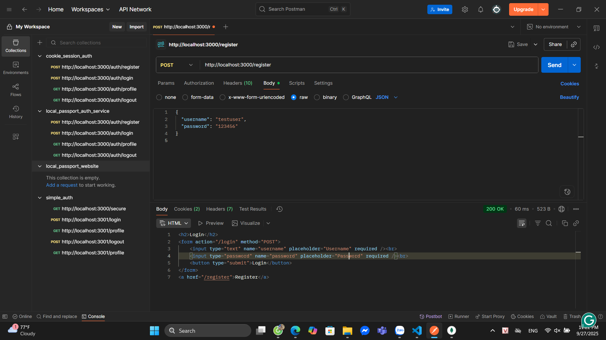
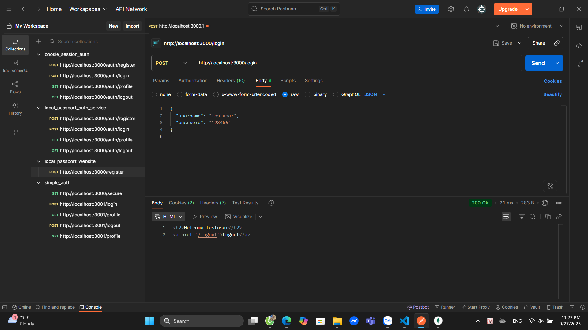
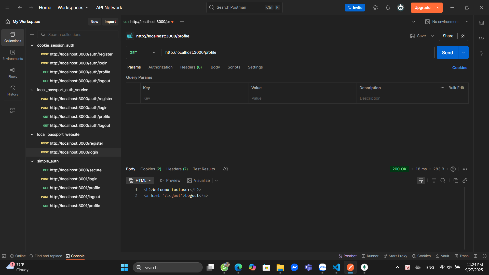
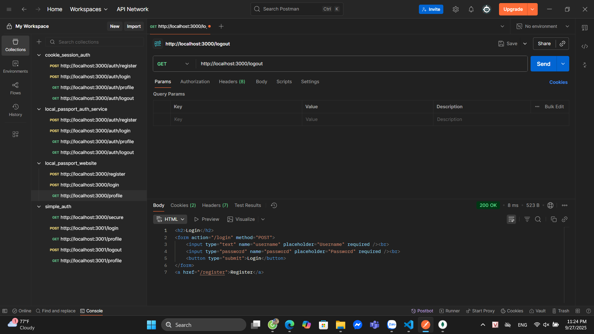
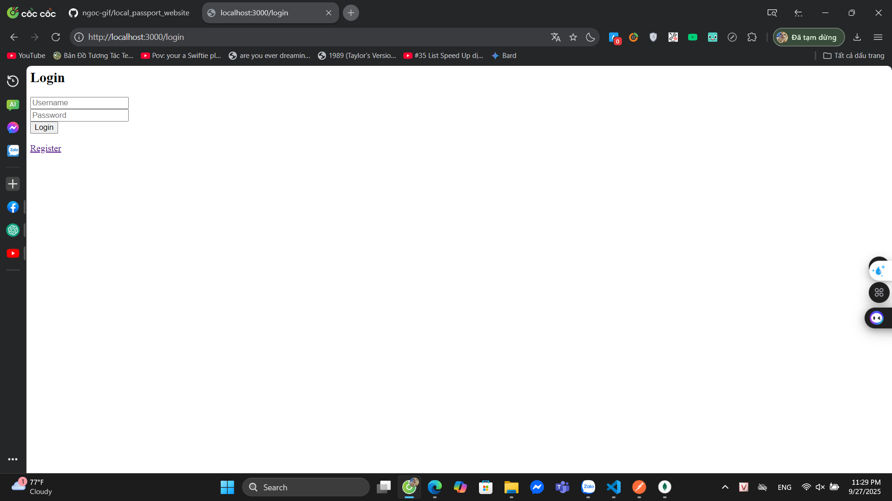
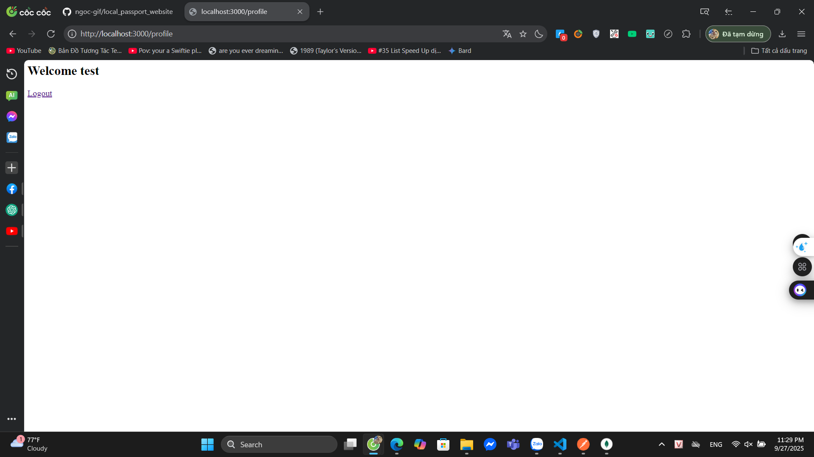

# local_passport_auth_service (LAB: Security in NodeJS)

## How to run
```bash
npm install
node app.js
```
⚠️ MongoDB phải chạy trước (local hoặc docker).

---

## Endpoints & How to test (POSTMAN)

### 🔹 Register
- **URL**: `POST http://localhost:3000/register`  
- **Body JSON**:
```json
{ "username": "bob", "password": "12345" }
```
- **Expected**: User registered, redirect `/login`  
- 

---

### 🔹 Login
- **URL**: `POST http://localhost:3000/login`  
- **Body JSON**:
```json
{ "username": "bob", "password": "12345" }
```
- **Expected**: Login success, redirect `/profile`  
- 

---

### 🔹 Profile
- **URL**: `GET http://localhost:3000/profile`  
- **Expected**: Hiển thị thông tin user trong profile page  
- 

---

### 🔹 Logout
- **URL**: `GET http://localhost:3000/logout`  
- **Expected**: Session destroyed, redirect `/login`  
- 

---

## How to test (UI in Browser)

### 🔹 Register UI
- Mở [http://localhost:3000/register](http://localhost:3000/register)  
- Nhập username & password → Submit → Redirect sang `/login`  
- 

---

### 🔹 Login UI
- Mở [http://localhost:3000/login](http://localhost:3000/login)  
- Nhập username & password → Submit → Redirect sang `/profile`  
- 

---

### 🔹 Profile UI
- Mở [http://localhost:3000/profile](http://localhost:3000/profile)  
- Hiển thị:  
  ```
  Welcome <username>
  Logout
  ```

---

### 🔹 Logout UI
- Nhấn **Logout** trên trang `/profile`  
- Redirect về `/login`, session bị xóa  
- 

---

## Commit & push lên GitHub
```bash
git init
git add .
git commit -m "Local passport auth lab"
git remote add origin https://github.com/ngoc-gif/local_passport_auth_service
git branch -M main
git push -u origin main
```